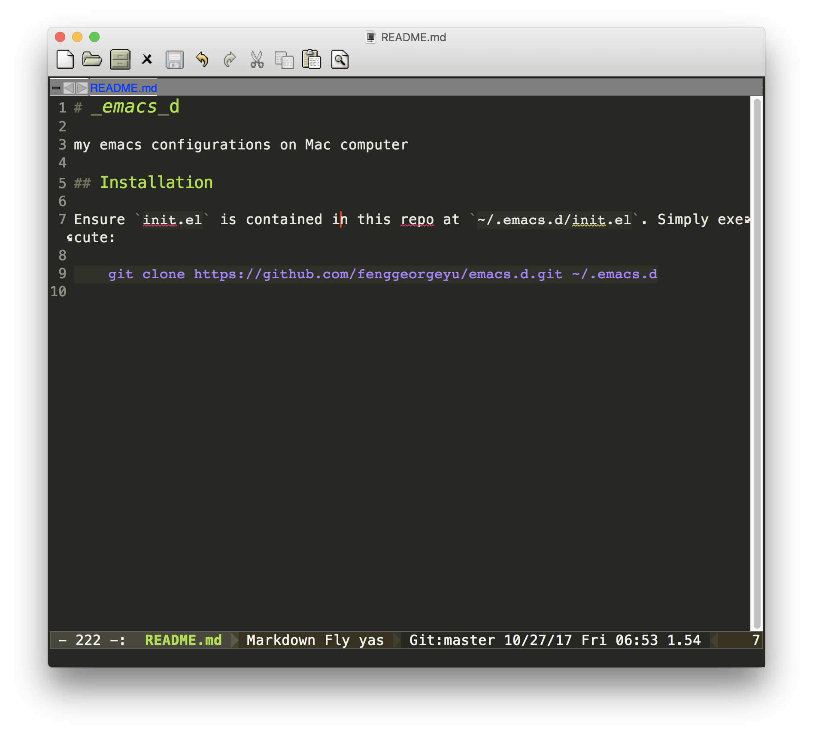

# _emacs_d

my emacs configurations on Mac computer

## Installation

Ensure `init.el` is contained i   n this repo at `~/.emacs.d/init.el`. Simply execute:

	git clone git@github.com:fenggeorgeyu/_emacs_d.git ~/.emacs.d

## Screenshots

